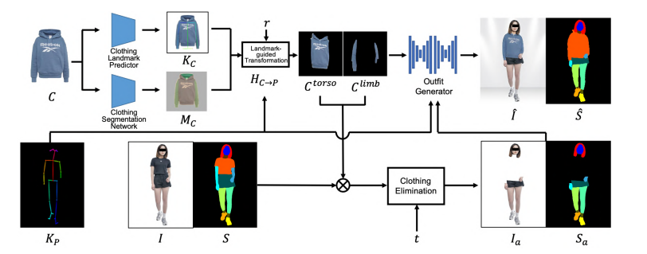
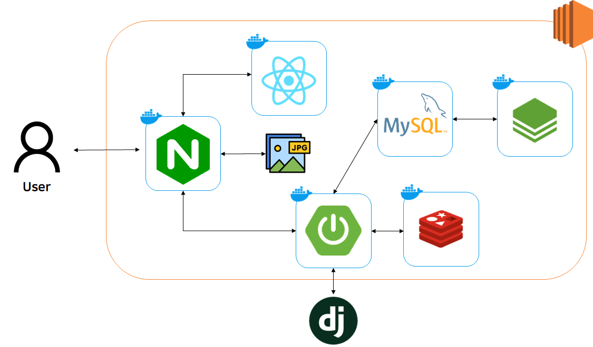
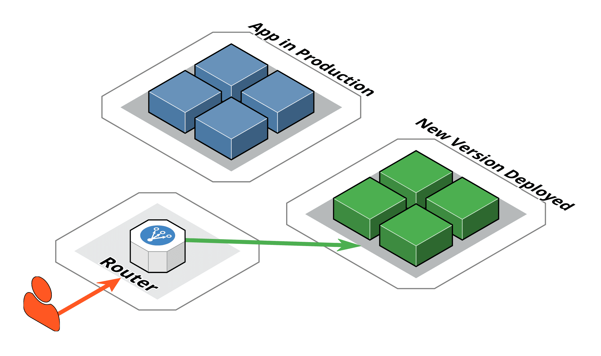

    

 
 

# 🛒🛍️Fit Me

> AI 피팅/추천 패션 쇼핑몰

**피팅 AI**를 통해 사용자가 제품을 미리 입어보고 **사회적 시간과 비용을 절약**

 

#  **📘** 프로젝트 진행 기간

2024.02 ~ 202.04 (6주)

 

# 👕 주요 기능

* 피팅 AI로 미리 입어보는 **드레스룸 기능**
* 메타 데이터를 활용한 **유사 상품 추천**(Content-based Filtering)
* Batch를 활용한 **실시간 랭킹 / 인기도 계산**

 

# 📱 페이지 목록

 

# ✔ 주요 기술

## AI 피팅

  

* openpose를 통한 모델 전처리
* COTTON-size-does-matter를 사용한 옷 전처리 및 합성
* 8300여개의 데이터를 통한 하의 학습 weights 생성 및 사용

 

# 🖥️ 인프라

## 시스템 아키텍처

  

- 자체 이미지 서버 직접 구축
- GPU서버에 장고로 만든 AI서버 가동

## 블루-그린방식을 사용한 무중단 배포

  

 

# 🛠️ 기술 스택
### BackEnd

### FrontEnd

### Infra

### 협업 툴

 

# 👪 팀원
<table>
  <tr>
    <td align="center" width="150px">
      
    </td>
    <td align="center" width="150px">
      
    </td>
    <td align="center" width="150px">
      
    </td>
    <td align="center" width="150px">
      
    </td>
    <td align="center" width="150px">
      
    </td>
    <td align="center" width="150px">
      
    </td>
  </tr>
  <tr>
    <td align="center">
      <a href="https://github.com/Jo-wonbin" target="_blank">
        차명훈 팀장 (Back-end)
      </a>
    </td>
    <td align="center">
      <a href="https://github.com/dudqo225" target="_blank">
        배유열 (Back-end)
      </a>
    </td>
    <td align="center">
      <a href="https://github.com/person003333" target="_blank">
        이상영 (Back-end)
      </a>
    </td>
    <td align="center">
      <a href="https://github.com/JeongHwan-dev" target="_blank">
        김중광 (Front-end)
      </a>
    </td>
    <td align="center">
      <a href="https://github.com/sojjeong" target="_blank">
        문성현 (Front-end)
      </a>
    </td>
    <td align="center">
      <a href="https://github.com/limejin">
        유시연 (Front-end)
      </a>
    </td>
  </tr>
</table>
